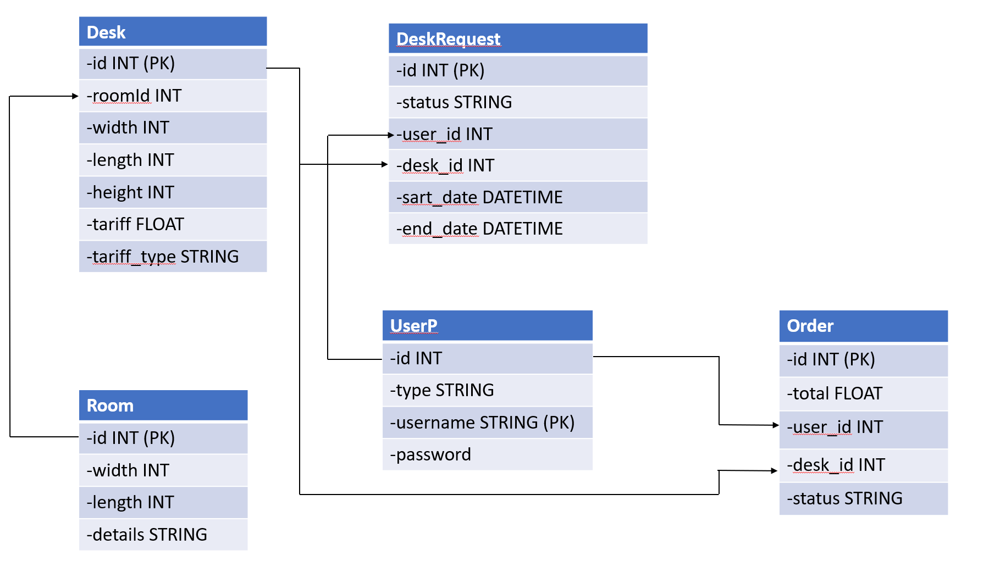

#  Aplicatie pentru spatii de coworking (App for Coworking Spaces)
## Descriere:
Acest proiect permite utilizatorilor sa inchirieze
birouri pe o anumita durata de timp, din spatii special destinate pentru munca pe care o desfasoara.  Utilizatorii pot vedea spatiile de lucru din aplicatie si sa inchirieze un birou pentru o anumita perioada de timp.  

## Functionalitati:  
### Utilizator Neingregistrat:
    * vizualizarea spatiilor
    * vizualizarea preturilor  
    * creare cont  
    * logare in cont  
### Utilizator Inregistrat:
    * vizualizarea spatiilor  
    * vizualizarea preturilor  
    * vizualizarea in timp real a birourilor ocupate  
    * posibilitatea de inchirere a unui birou  
    * anularea comenzii plasate
    * plata comenzii 
### Administrator:
    * crearea de conturi  
    * programarea utilizatorilor  
    * anularea comenzilor plasate de catre utilizatori  
    * vizualizare in timp real a birourilor  
    * adaugarea/stergerea de camerea  
    * adaugarea/stergerea de birouri  
    
## Diagrama Baza de Date:

## Endpoint-uri:  
Adresa: localhost:8080/demo
### /user:  
    * GET /all      -> returneaza o lista cu toti utilizatorii  
    * POST /add      -> adauga un user  
                     -> body: {"username",    "password", "type"}  
                     -> returneaza un mesaj de succes/ eroare  
    * PUT /update    ->
    * DELETE /delete ->
    
